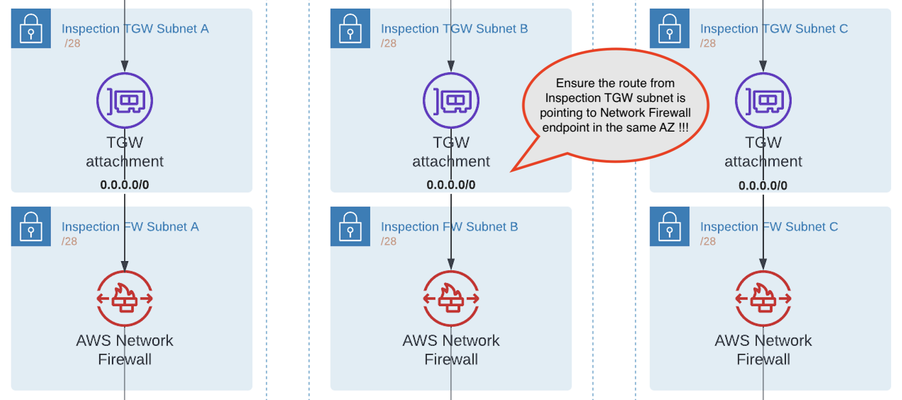
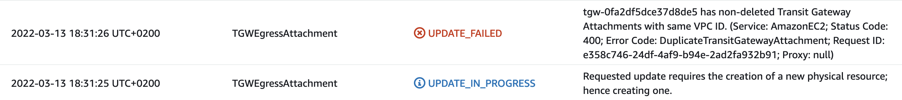

## AWS Inspection and Egress VPCs template

Below is the implementation of "3) North-South: Centralized internet egress" from AWS blog [Deployment models for AWS Network Firewall](https://aws.amazon.com/blogs/networking-and-content-delivery/deployment-models-for-aws-network-firewall/)

### Generating templates

`vpc.yaml.j2` is Jinja2 template that will generate Cloudformation YAML template with
input from `config.json` in this same directory. To render `vpc.yaml` you need to

* Install Jinja CLI

```
% pip install jinja-cli
``` 

* Render Cloudformation template

``` 
% jinja2 vpc.yaml.j2 config.json > vpc.yaml
```

Or you can just say `./build.sh` to generate the template and verify with [cfn-lint](https://github.com/aws-cloudformation/cfn-lint)

### Template features
* 2 VPCs; inspection and egress
* 6 x /28 subnets for each AZ in both VPCs
* One layer of subnets to host TGW attachments
* One layer of subnets to host Network Firewall or NAT Gateways.
* Internet gataway attached to egress VPC
* Public NAT gateway for each AZ in egress VPC
* Option to use pre-allocated EIPs for Public NAT gateways
* Network Firewall deployed across all AZs in inspection VPC


### Template parameters

#### Inspection VPC

   * InspectionVpcCidr

/25 CIDR for inspection VPC. This is split to /28 subnets for each AZ for TGW attachments and Network Firewall.

#### Egress VPC

   * EgressVpcCidr

/25 CIDR for egress VPC. This is split to /28 subnets for each AZ for TGW attachments and NAT gateways.

   * EipA (optional)
   * EipB (optional)
   * EipC (optional)

Optional pre-allocated EIPs for NAT gateways. If left empty, new EIPs will be created. Created EIPs
are not deleted at stack update or deletion to protect agains losing public IPs accidentially.
You should remember to delete EIPs manually when those are no longer needed.

#### TGW Configuration

   * TgwAttachment (optional)

Transit Gateway ID that is attached to both VPCs. Note that you must leave this empty during
the initial deployment of because TGW attachment isn't part of template but must done manually.
Once stack has been created and Transit Gateway is attached to both VPCs, you must update
the stack with TGW ID to complete routing configuration.

   * TgwRouteCidr1 (optional)
   * TgwRouteCidr2 (optional)
   * TgwRouteCidr3 (optional)

These are the CIDRs that cover all client VPCs attached to Transit Gateway. CIRDs can be larger
than actual VPCs are using but can't be any smaller. Especially you can not use 0.0.0.0/0
here because default route is pointing to Internet Gatway from Egress public subnets.
Even if these are optional parameters, it is mandatory to supply atleast one CIDR before
routing can be functional. Initial deployment can be made with or without these parameters
as routing is not enabled until `TgwAttachment` is provided.

### Deployment

Deployment is 2 step process. First you must create the stack WITHOUT providing `TgwAttachment` value.
This will create most of the infrastructure but subnet routing is not functional at this point.

Now you should correct Inspection TGW Subnet's routing. When routing from Inspection TGW subnets
to Network Firewall endpoints is configured, it isn't possible match subnets and endpoints so that
traffic would stay within the same AZ.

From [AWS::NetworkFirewall::Firewall](https://docs.aws.amazon.com/AWSCloudFormation/latest/UserGuide/aws-resource-networkfirewall-firewall.html)
> GetAtt.EndpointIds
>
> The unique IDs of the firewall endpoints for all of the subnets that you attached to the firewall. The subnets are not listed in any particular order. For example: ["us-west-2c:vpce-111122223333", "us-west-2a:vpce-987654321098", "us-west-2b:vpce-012345678901"].



Configuration will work even if you don't fix this, but it will cause extra charges due to
cross-AZ traffic and lower your availability because loss of either TGW attachment or Firewall endpoint AZ
will break the traffic flow.

Next step is manually add Transit Gateway attachments for all AZs in both Inspection and Egress VPCs.
Attachments are not part of Cloudformation template because the bug in `AWS::EC2::TransitGatewayAttachment`
resource triggers replacement on any update, including tag changes. Combining this with Cloudformation logic
of first creating the new resource before removing the old and there can be only single attachment per
VPC for TGW, makes it impossible to do any changes to attachment after initial deployment :-(



When attaching Inspection and Egress VPCs, please note that there must be 2 Transit Gateway routing
tables. One (Spoke Inspection) which all client VPC are associated by default, and another (Firewall)
where all client VPC CIDRs are propagated to. You should associate Inspection VPC attacments with
Spoke Inspection and Egress VPC with Firewall route table.


Once Transit Gateway is attached to both VPCs in all 3 AZs, you must update the stack and provide
Transit Gateway ID and (up to 3) CIDRs covering all networks connected to it. This will complete
routing configuration of subnets.

### Enable shared Egress NAT GWs and Firewall

Now you are ready to attach a client VPC to Transit Gateway and associate it Spoke Inspection route table.
This will enable outbound internet access through Network Firewall and Shared NAT Gateways.

If your outbound internet access was going through local NAT gateway like this


All you have to do is change that to Transit gateway. You may need to do this each AZ separately
depending how many route tables you have.


Routing change will not cause any significant lost of internet access but it will change the NAT Gateway IP address that shows to server as source address of your connection.

```
64 bytes from 8.8.8.8: icmp_seq=319 ttl=109 time=1.36 ms
64 bytes from 8.8.8.8: icmp_seq=320 ttl=109 time=1.17 ms
64 bytes from 8.8.8.8: icmp_seq=321 ttl=109 time=1.17 ms
64 bytes from 8.8.8.8: icmp_seq=322 ttl=109 time=1.27 ms
64 bytes from 8.8.8.8: icmp_seq=323 ttl=109 time=1.16 ms
64 bytes from 8.8.8.8: icmp_seq=324 ttl=53 time=3.74 ms     <- This is where route changed from local NAT to TGW
64 bytes from 8.8.8.8: icmp_seq=325 ttl=53 time=1.24 ms
64 bytes from 8.8.8.8: icmp_seq=326 ttl=53 time=1.25 ms
64 bytes from 8.8.8.8: icmp_seq=327 ttl=53 time=1.22 ms
```


