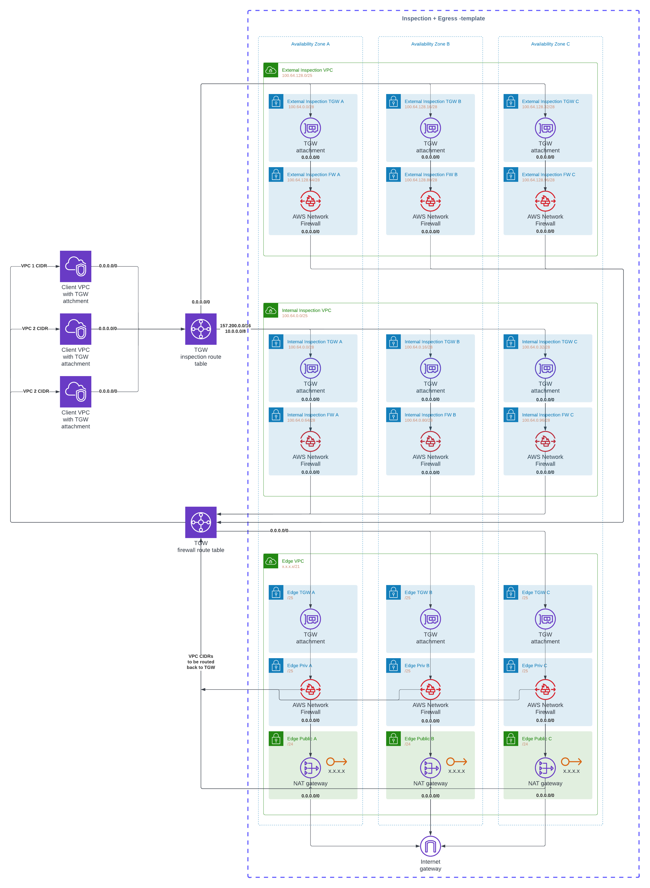

## AWS Inspection and Edge VPCs template

Below is based on the implementation of **"3) North-South: Centralized internet egress"** from AWS blog [Deployment models for AWS Network Firewall](https://aws.amazon.com/blogs/networking-and-content-delivery/deployment-models-for-aws-network-firewall/)

### Template features
* 3 VPCs; internal + external inspection and edge
* Subnets for each AZ in all VPCs
* One layer of subnets to host TGW attachments
* One layer of subnets to host Network Firewall or NAT Gateways.
* Internet gataway attached to edge VPC
* Public NAT gateway for each AZ in edge VPC
* Option to use pre-allocated EIPs for Public NAT gateways
* 2 Network Firewall deployed across all AZs in internal and external inspection VPCs



### Template parameters

#### Inspection VPCs

   * InternalInspectionVpcCidr (default 100.64.0.0/25)
   * ExternalInspectionVpcCidr (default 100.64.128.0/25)

/25 CIDR for each inspection VPC. This is split to /28 subnets for each AZ for TGW attachments and Network Firewall.
Here you can use a static values from 100.64.0.0 for all deployments as these CIDRs will not
be in any of TGW route-tables, only the default route 0.0.0.0/0 will point to inspection VPCs.
It is also not routable CIDR in AWS so there is no risk that any of client VPCs connected to TGW would
have overlap with these.

#### Edge VPC 

   * EdgeVpcCidr (default 10.120.0.0/21)

/21 CIDR for edge VPC. This is split to subnets for each AZ for TGW attachments and NAT gateways.
Here you must ensure the CIDR doesn't overlap with any other networks reachable from TGW.

   * EipA (optional)
   * EipB (optional)
   * EipC (optional)

Optional pre-allocated EIPs for NAT gateways. If left empty, new EIPs will be created. Created EIPs
are not deleted at stack update or deletion to protect agains losing public IPs accidentially.
You should remember to delete EIPs manually when those are no longer needed.

#### TGW Configuration

   * TgwAttachment (optional)

Transit Gateway ID that is attached to both VPCs. Note that you must leave this empty during
the initial deployment of because TGW attachment isn't part of template but must done manually.
Once stack has been created and Transit Gateway is attached to both VPCs, you must update
the stack with TGW ID to complete routing configuration.

   * TgwRouteCidr1 (optional)
   * TgwRouteCidr2 (optional)
   * TgwRouteCidr3 (optional)

These are the CIDRs that cover all client VPCs attached to Transit Gateway. CIRDs can be larger
than actual VPCs are using but can't be any smaller. Especially you can not use 0.0.0.0/0
here because default route is pointing to Internet Gatway from Egress public subnets.
Even if these are optional parameters, it is mandatory to supply atleast one CIDR before
routing can be functional. Initial deployment can be made with or without these parameters
as routing is not enabled until `TgwAttachment` is provided.

### Deployment

Create stack and supply TGW ID and at least one CIDR routed from Egress VPC to Transit Gateway.
While these are optional parameters, without them the VPCs build from the stack don't serve any purpose.
Both Inspection and Egress VPC are attach to TGW default route table. You must manually modify TGW routing
to have 2 route tables. One (Spoke Inspection) which all client VPC are associated by default, and another (Firewall) where all client VPC CIDRs are propagated to. You should associate Inspection VPC with
Spoke Inspection and Egress VPC with Firewall route table.

NOTE: It is not possible to create a sample TGW with Cloudformation because of a bug that prevents
creating association and propagation default route tables for TGW in Cloudformation. See https://github.com/aws-cloudformation/aws-cloudformation-resource-providers-transitgateway/issues/125


Once Transit Gateway is attached to both VPCs in all 3 AZs, you must update the stack and provide
Transit Gateway ID and (up to 3) CIDRs covering all networks connected to it. This will complete
routing configuration of subnets.

### Enable shared Egress NAT GWs and Firewall

Now you are ready to attach a client VPC to Transit Gateway and associate it Spoke Inspection route table.
This will enable outbound internet access through Network Firewall and Shared NAT Gateways.

If your outbound internet access was going through local NAT gateway like this


All you have to do is change that to Transit gateway. You may need to do this each AZ separately
depending how many route tables you have.


Routing change will not cause any significant lost of internet access but it will change the NAT Gateway IP address that shows to server as source address of your connection.

```
64 bytes from 8.8.8.8: icmp_seq=319 ttl=109 time=1.36 ms
64 bytes from 8.8.8.8: icmp_seq=320 ttl=109 time=1.17 ms
64 bytes from 8.8.8.8: icmp_seq=321 ttl=109 time=1.17 ms
64 bytes from 8.8.8.8: icmp_seq=322 ttl=109 time=1.27 ms
64 bytes from 8.8.8.8: icmp_seq=323 ttl=109 time=1.16 ms
64 bytes from 8.8.8.8: icmp_seq=324 ttl=53 time=3.74 ms     <- This is where route changed from local NAT to TGW
64 bytes from 8.8.8.8: icmp_seq=325 ttl=53 time=1.24 ms
64 bytes from 8.8.8.8: icmp_seq=326 ttl=53 time=1.25 ms
64 bytes from 8.8.8.8: icmp_seq=327 ttl=53 time=1.22 ms
```
